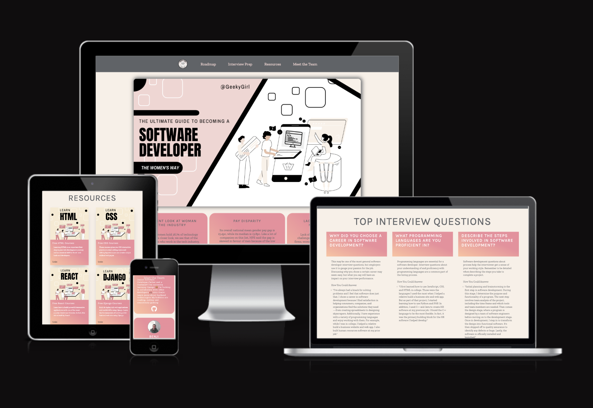
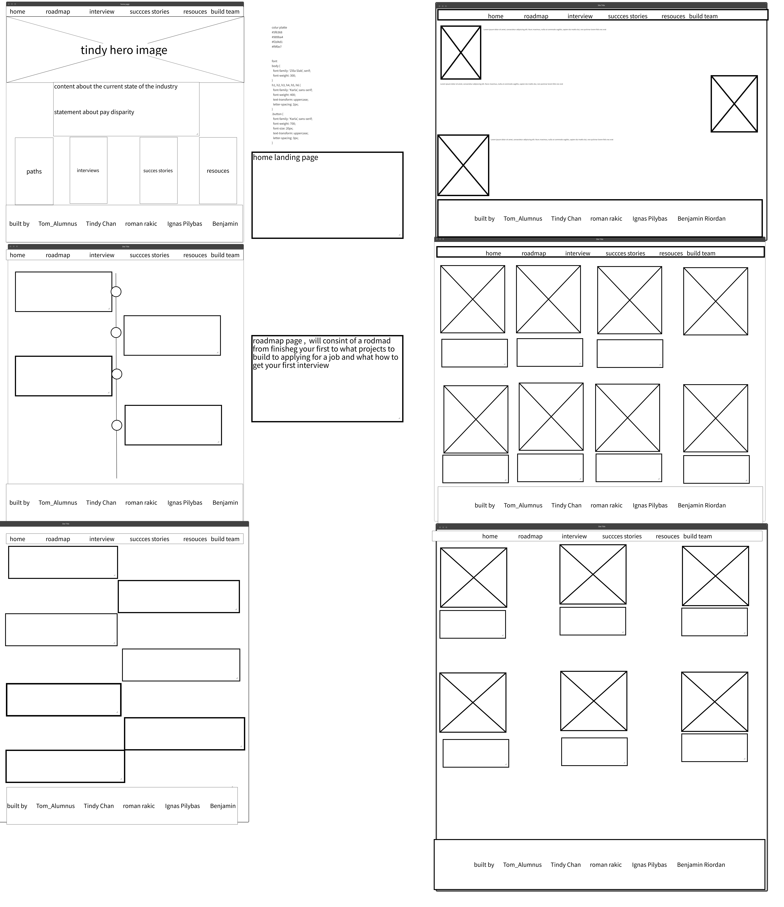
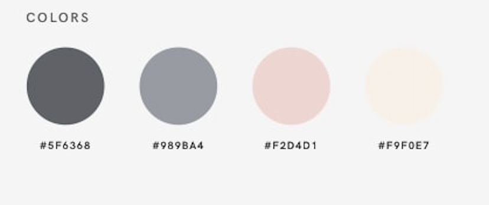

# **Geeky Girl**

---

March 2023 Hackaton Project- Women In Tech

Geeky Girl is a revolutionary platform designed for women who aspire to become software developers. Developed by "Tindy and her minions", this app provides a roadmap to becoming a skilled programmer, with a particular focus on empowering women in the tech industry. With its user-friendly interface and engaging learning resources, Geeky Girl offers a comprehensive learning experience for aspiring developers of all skill levels. Whether you're a beginner or an experienced programmer, Geeky Girl offers an array of resources, including interview preparation guides and free courses, to help you achieve your career goals. Join the Geeky Girl community today and discover the power of women in tech!

## **Demo**

---

A live demo can be found [here](https://geeky-girl.vercel.app/).

## **User Experience**

---

In this section, We are going to provide insights into my UX process, mainly focusing on who this web application is built for, what they intent to achieve and how they can best utilise this web application to fulfil their needs.

According to Caglar Araz from UX Collective, User Experience (UX) is "User experience refers to the singular and accumulated experiences that occur for users as a consequence of them interacting with an object in a given context."

The planning and development of this project is divided into 5 planes:

1. The Strategy Plane
2. The Scope Plane
3. The Structure Plane
4. The Skeleton Plane
5. The Surface Plane

## **Strategy Plane**

---

### Creator Goals

-   to create an interactive web application that is fully responsive on desktop to smaller devices such as mobile.

-   to create a website with interface design, presenting a logical structure allowing users to easily navigate.

-   to build a site that female users will find enriching and rewarding following our roadmap to becoming a software developer.

### User Stories

-   As a first-time user, I would like the purpose of the website to be clear and straight forward.

-   As a first-time user, I would like to be able to navigate to desired sections on the site without having to search and scroll.

-   As a first-time user, I would like to easily access resources and guidance on becoming a software dev.

## **Scope Plane**

-   A simple home page with responsive navigation bar to allow user to easily navigate without having to scroll and to show the purpose of the website.

-   Simple roadmap design that is visually appealing, non-distracting and easy to follow.

-   Interview preparations and many more resources provided in different sections of the site so users can easily access to gain knownledge in becoming a software dev.

-   Testimonials are shared on the Success Stories section to encourage and motivate users to follow our guide to reach their goals and offer reassurance.

-   The design of the website should be visually consistent across all aspects to make it visually pleasing and comfortable for users.

-   The web application should be responsive across different resolutions.

## **Structure Plane**

---

1. Home

    - Navbar is always fixed on top of the page with "Geeky Girl" logo on the left-hand side of the bar and a menu on the right with clear names of site pages for the ease of navigation. The colour will change to #989BA4 when the users hovers over them to reinforce the links are clickable. This Navbar will stay consistent throughout the entire website and will automatically minimised into a hamburger menu on smaller devices.

    - The content of the home page contains a brief on the current state of the industry for women and statements regarding pay disparity between genders.

    - The Success Stories section consists of testimonies of female users in using our site in reaching their goals.

    - A footer with social media links is featured at the bottom to allow users to easily connect with the dev team.

2. Roadmap

    - The content of the Roadmap section consists of a simple but impactful timeline providing an easy roadmap for users to follow to becoming a software dev.

3. Interview Preparation

    - The content of the Interview prep section consists of an overview of the top tips on how to prepare for a software engineer interview and possible questions to ask employers for equal pay.

4. External Resources

    - The content of the resources section consists of cards displaying info and links to external resources.

5. Dev Team
    - The content of the Dev Team page consists of profile cards of memebers of the team displaying social links and brief info.

### **Skeleton**

Wireframe

## **Surface**

---

### Design

Our desire is to design a web application that is clean and crisp with minimal distractions. All the fonts and styles are consistent throughout the site to make the users feel comfortable. With the help of CSS styles and media queries, the site is responsive across devices from desktop, laptop, tablet to mobile. Even on smaller devices, the contents are aligned proportionally and styled to make sure they are still legible and well-displayed. Altogether, the design and layout of the site should be entertaining and captivating so that a user is able to understand and enjoy the site.

### Typography

The fonts I have chosen for the site is Zilla Slab with Sans Serif as a fall back.

The website is fully responsive across all devices with the help of CSS styling and media queries to custom font sizes (smaller for mobile devices) and styles to keep all the content in place and legible.

### Colour Scheme

## **Features**

This project is neat and straight forward. It is logically designed whilst also keeping design consistency in all aspects of the page. The navigation bar allows easy navigation with faster, more efficient access to the desired content. It stays fixed on top of the page. It is responsive across different resolutions and collapses according to screen size at 768px width or smaller to encourage a user-friendly and minimalist design. Hover effect is used in all links and icons to add a bit of animation to the site to make it more appealing and to reinforce the links are clickable. The links will open a new tab so that the user does not leave the site. The use of CSS and media queries have allowed the site to be responsive across various devices.

### Home page

- Large quintessential Hero image, with heading text laid on top, is in the header of the home page to draw the attention of the users and to encourage users to read more. 

- Brief intro on the current state of the industry for women and statements regarding pay disparity between genders. The Narbar provides direct links to all section of the site. The footer contains social links to allow users to connect with site owner.

### Path to Tech

- Animated timeline to display roadmap to becoming a software developer.

### Interviews

- Interview preparation guide with top interview questions and approaches to how to answer them displayed in various cards.

### External Resources

- Links to  Free courses from external resources displayed in cards.

### Meet the team

- Profile cards displaying the developer's Team.

### Features to be implemented in the future

- Authetication system to allow users to sign up and connect with each other.

- Messaging system to allow users to communicate with each other.

## **Technologies**

---

-   [HTML5](https://www.w3schools.com/html/) - language used to build the basic structure of the project.

-   [CSS](https://www.w3schools.com/css/) - language used to style the HTML elements.

-   [React](https://react.dev/) - language used to build user interfaces based on components. 

-   [Font Awesome](https://fontawesome.com/)- provided icons to create social links.

-   [Git](https://git-scm.com/) - version control software used to commit and push code to GitHub.

-   [Gitpod](https://gitpod.io/) - workspace for development the project.

-   [GitHub](https://github.com/) - hosting site for storing code for the project with Github Pages used to deploy the live site.

-   [Google Chrome DevTools](https://developers.google.com/web/tools/chrome-devtools) - used for inspecting elements in finding issues and bugs and testing responsiveness of the project.

-   [Am I Responsive](http://ami.responsivedesign.is/)- site used to create multi-device image to illustrate responsiveness

## **Testing**

---

### Code Validation

#### HTML

-   All HTML code was tested and validated with W3C Markup Checker.

#### CSS

-   All CSS code was tested and validated with W3C CSS Validation Service.
-   No errors or warnings reported.

### Link Testing

-   All the external links in the page will open in a new tab implementing 'target="\_blank"' and have been manually tested to confirm that they will direct to the correct destination.
-   All the internal site links will navigate to the right path and have been manually tested to confirm they will direct user to expected page.
-   By clicking on the "Submit" button in the contact form, if all the fields are filled correctly and in the right format, an email will be sent to the site owner and an alert will pop up to indicate the form is sent.

## **Deployment**

---

This project is hosted using Vercel.
The deployed site automatically updates simultaneously to new commits to the master branch.

## **Credits**

---

### Media

All images created using CANVA.com

### Acknowledgements

We would like to thank Code Institute for creating this wonderful opportunity and bringing our team together to build this amazing app to contribute to the advancement of women in the tech industry. And of course, our family and friends for their love and supporting whilst we were busy coding!
